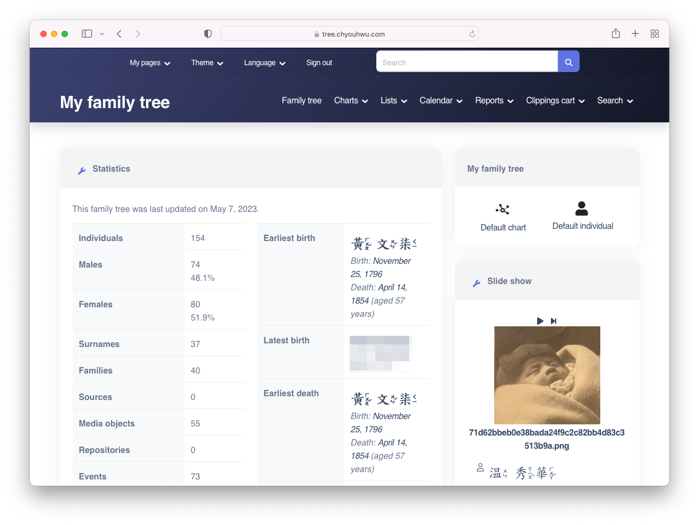

# tree 🏡

[][site]

Private family genealogy site.

1796 - 2017, Taiwan to USA.

[][site]

## Added Features

- [Zhuyin][wiki-zhuyin] for Traditional Chinese

## Setup

Set up [vps][repo-vps] with reverse proxy.

Copy the example environment file and update the configs.

```sh
cp .env.example .env
```

Build and start the service.

```sh
make start
```

## Backup and Recovery

TODO: Back up to remote storage.

### Backup

Schedule this backup job on the local machine.

```
0 22 * * * cd /path/to/repo && ./scripts/backup.sh
```

- Backs up the MySQL `webtrees` database and `data` directory
- Zips the backup files and downloads to the local `backup` directory
- Cleans up local backups greater than 7 days

### Recovery

Create the `webtrees` database and user.

Import the MySQL backup.

Restore the `data` directory to `/var/www/html/` in the container and modify `/var/www/html/data/config.ini.php` with latest configs.


[repo-vps]: https://github.com/tifa/vps
[site]: https://tree.tifa.dev
[wiki-zhuyin]: https://en.wikipedia.org/wiki/Zhuyin
